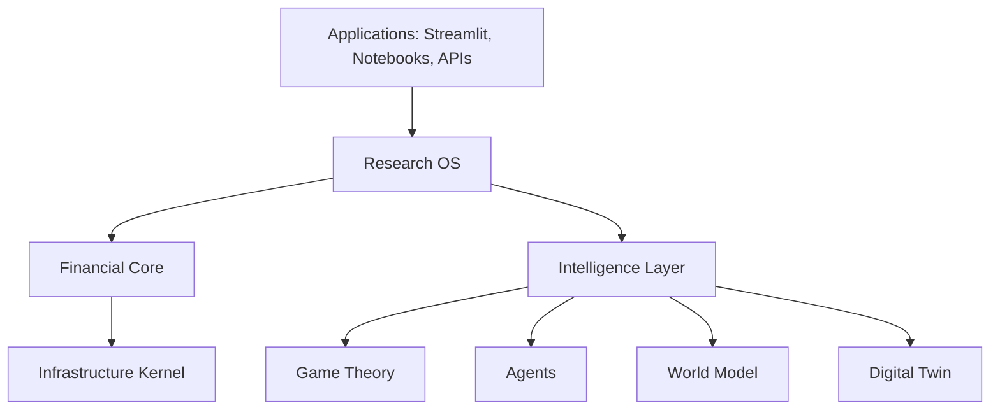

# AQRL — Autonomous Quant Research Lab

[](https://github.com/FaberMach/Autonomous-Quant-Research-Lab/actions/workflows/ci.yml)

AQRL is an institutional-grade autonomous quantitative research platform for systematic finance, designed to combine portfolio research, risk analytics, market regimes, game theory, multi-agent learning, digital twins, execution intelligence, and AI-assisted alpha discovery.

> Status: Foundation track through M008 is implemented. The package version remains 0.1.0 while the repository now includes core infrastructure, data persistence, data-quality checks, feature and regime engines, baseline strategies, deterministic backtesting, reporting artifacts, risk analytics, portfolio rebalancing primitives, executable examples, and a local client view.

## Core Thesis

Financial markets are not only time series. They are adaptive, partially observable, multi-agent systems. AQRL is designed to model markets through states, agents, policies, risk budgets, experiments, and continuously validated hypotheses.

## Strategic Objectives

AQRL aims to become a modular platform for:

- quantitative research and backtesting;
- portfolio construction and risk management;
- regime detection and multifractal analysis;
- financial game theory and multi-agent learning;
- adaptive market making and dynamic hedging;
- digital twin simulation;
- AI-assisted strategy discovery;
- research governance, auditability, and reproducibility.

## Architecture



## Main Packages

```text
aqrl/
  core/           Infrastructure kernel: config, logger, events, registry, plugin manager, scheduler, constants, exceptions, types, utils
  data/           Loader abstractions, cache, feature store, dataset registry, Parquet/DuckDB persistence, canonical MarketState
  features/       Rolling market features and simple regime classification
  portfolio/      Constraints, rebalance plans, portfolio construction
  risk/           Return analytics, risk summaries, drawdown, VaR/CVaR, Sharpe/Sortino
  execution/      Broker abstractions and execution algorithms
  research/       Strategy interfaces, baseline strategies, validation, backtesting
  optimization/   Optimizers and objective functions
  agents/         Multi-agent policies and coordination
  game_theory/    Financial WOP-CFR, PM-PSRO, meta-solvers
  world_model/    Market representation and financial foundation models
  digital_twin/   Synthetic market simulation
  dashboards/     Local client view and reporting applications
  llm/            LLM integrations and research copilots
  utils/          Shared utilities
```

## Installation

## Canonical Development Workspace

Use the Git-backed clone as the canonical working tree:

```text
C:\Users\fabri\OneDrive\Documentos\Portfolio\Autonomous-Quant-Research-Lab-publish
```

The previous non-Git project folder can remain as a backup, but new work should
start from the canonical clone so commits, CI, and GitHub stay aligned.

### With Poetry

```bash
poetry install
poetry run ruff check .
poetry run black --check .
poetry run mypy aqrl tests
poetry run pytest
```

### With pip

```bash
python -m venv .venv
source .venv/bin/activate  # Windows: .venv\\Scripts\\activate
pip install -e .
pip install pytest pytest-cov ruff==0.6.9 black==24.10.0 mypy pandas-stubs types-PyYAML
ruff check .
black --check .
mypy aqrl tests
pytest
```

### Pre-commit

```bash
poetry install
poetry run pre-commit install
poetry run pre-commit run --all-files
```

## Configuration

AQRL exposes `aqrl.core.config.Config` as the bootstrap settings layer.

- Defaults cover the project name, environment, logging, directories, and the random seed.
- `Config.from_yaml(...)` loads a YAML mapping.
- `Config.from_env(...)` reads `AQRL_*` environment variables.
- `Config.load(...)` applies YAML first, then environment overrides.

Example:

```yaml
project_name: AQRL
environment: staging
debug: true
log_level: DEBUG
data_dir: data/staging
cache_dir: .cache/staging
artifacts_dir: artifacts/staging
random_seed: 42
```

```python
from pathlib import Path

from aqrl.core.config import Config

config = Config.load(
    yaml_path=Path("configs/local.yaml"),
    environ={"AQRL_LOG_LEVEL": "INFO"},
)
```
## Logging

AQRL uses `aqrl.core.logger.create_logger(...)` to configure structured
JSON-line logging for both the console and optional file outputs.

```python
from pathlib import Path

from aqrl.core.logger import create_logger

logger = create_logger("aqrl", log_file=Path("logs/aqrl.log"))
logger.info("pipeline started", extra={"run_id": "demo-1"})
```

The console output is structured for machine consumption, while the file handler
lets you persist the same payloads during longer experiments.

## Plugin Management

AQRL uses `aqrl.core.plugin_manager.PluginManager` to register and initialize
in-process plugins against the shared configuration and event bus.

```python
from aqrl.core.plugin_manager import PluginManager

manager = PluginManager()
```

## Scheduling

AQRL uses `aqrl.core.scheduler.Scheduler` for simple synchronous task
registration and execution inside the research process.

```python
from aqrl.core.scheduler import Scheduler

scheduler = Scheduler()
```

## Market State

AQRL uses `aqrl.data.market_state.MarketState` as the canonical immutable
snapshot for prices, returns, volatility, and metadata.

```python
from aqrl.data.market_state import MarketState

state = MarketState(prices={"AAPL": 101.25})
```

## Data Layer

AQRL uses `aqrl.data` to standardize market-data ingestion and local storage.

- `aqrl.data.base_loader.BaseLoader` defines a shared load-request contract.
- `aqrl.data.cache.DataCache` persists Python objects on disk.
- `aqrl.data.feature_store.FeatureStore` stores named feature frames and metadata.
- `aqrl.data.dataset_registry.DatasetRegistry` catalogs versioned datasets.
- `aqrl.data.market_data_store.MarketDataStore` writes Parquet datasets and queries them through DuckDB.
- `aqrl.data.data_quality.validate_market_data` emits structured quality reports.
- `aqrl.data.yahoo_loader.YahooFinanceLoader` fetches historical prices from Yahoo Finance and can cache responses.

```python
from aqrl.data import DataCache, FeatureStore, MarketDataStore, YahooFinanceLoader

cache = DataCache(".cache/data")
loader = YahooFinanceLoader(cache=cache)
store = FeatureStore(".cache/features")
market_store = MarketDataStore("artifacts/market_data")
```

## Risk And Portfolio

AQRL uses `aqrl.risk` and `aqrl.portfolio` for canonical risk summaries and
deterministic rebalance plans.

- `calculate_returns` supports simple and log returns.
- `summarize_returns` reports volatility, drawdown, VaR, CVaR, Sharpe, and Sortino.
- `PortfolioConstraints` validates min/max weights and net exposure.
- `SimpleRebalancer` returns target weights, trades, and turnover.

```python
from aqrl.portfolio import PortfolioConstraints, SimpleRebalancer
from aqrl.risk import calculate_returns, summarize_returns

returns = calculate_returns(equity_curve)
risk = summarize_returns(returns)
plan = SimpleRebalancer().rebalance(
    current_weights={"AAPL": 0.5, "MSFT": 0.5},
    desired_weights={"AAPL": 0.7, "MSFT": 0.3},
    constraints=PortfolioConstraints(max_weight=0.8),
)
```

## Features And Regimes

AQRL uses `aqrl.features` for deterministic market feature generation and
simple regime classification.

- `build_market_features` emits returns, rolling return, volatility, momentum, and drawdown.
- `classify_market_regimes` labels trend and volatility states.

```python
from aqrl.features import FeatureConfig, RegimeConfig
from aqrl.features import build_market_features, classify_market_regimes

features = build_market_features(market_data, config=FeatureConfig(momentum_window=5))
regimes = classify_market_regimes(features, config=RegimeConfig(momentum_threshold=0.005))
```

## Research MVP

AQRL uses `aqrl.research` for reproducible strategy research and backtesting.

- `Strategy` defines the fit/generate-signals contract.
- `BuyAndHoldStrategy` and `MovingAverageCrossoverStrategy` provide deterministic baselines.
- `BacktestEngine` returns equity curves, positions, trades, and risk-aware summary metrics with transaction-cost support.
- `BacktestReportWriter` exports summary JSON, CSV tables, Markdown, HTML, and a manifest.

```python
from aqrl.research import BacktestEngine, BacktestReportWriter, BuyAndHoldStrategy

signals = BuyAndHoldStrategy().generate_signals(market_data)
result = BacktestEngine().run(market_data, signals, initial_capital=100_000)
artifacts = BacktestReportWriter("artifacts/backtests").write(result, run_name="demo")
```

## Examples

Executable offline examples live in `examples/`:

- `examples/01_data_pipeline.py`
- `examples/02_strategy_backtest.py`
- `examples/03_risk_portfolio_rebalance.py`

Run them with Poetry:

```bash
poetry run python examples/01_data_pipeline.py
poetry run python examples/02_strategy_backtest.py
poetry run python examples/03_risk_portfolio_rebalance.py
```

## Client View

AQRL includes a local dependency-free client view for interacting with the
demo model flow through a browser and JSON endpoint.

```bash
poetry run python -m aqrl.dashboards.client_view --open
```

On Windows, you can also use:

```powershell
.\scripts\start_client_view.ps1 -Open
```

If the browser does not open automatically, open:

```text
http://127.0.0.1:8765
```

Health check:

```text
http://127.0.0.1:8765/health
```

The page includes an equity-curve chart, model metrics, raw JSON payload, and a
download button for the latest result.
## First Milestones

1. Release 0.1.0 — Bootstrap
2. Release 0.2.0 — Core Infrastructure
3. Release 0.3.0 — Data Layer and MarketState
4. Release 0.4.0 — Portfolio and Risk Engines
5. Release 0.5.0 — Research OS and Backtesting
6. Release 0.6.0 — Regime and Multifractal Engine
7. Release 0.7.0 — Financial Game Theory
8. Release 0.8.0 — Digital Twin
9. Release 1.0.0 — Institutional MVP

## Development Principles

- Python 3.12+
- Clean Architecture
- SOLID
- Domain-Driven Design
- Hexagonal Architecture
- Type hints everywhere
- Google-style docstrings
- pytest-based tests
- ruff + black + mypy
- ADRs for architectural decisions
- Every strategy must be reproducible, auditable, and stress-tested

## Current Release Contents

The current foundation includes:

- repository skeleton;
- project metadata;
- baseline documentation and architecture specification;
- backlog structure;
- agent roles for AI-assisted development;
- CI and quality tooling configuration.
- core infrastructure primitives;
- data registry, persistence, and validation primitives;
- baseline strategy and backtest primitives.
- risk metrics and portfolio rebalancing primitives.
- feature/regime primitives, offline examples, reporting artifacts, and a local client view.

## Next Step

Use Codex with the prompt in `AGENTS.md` to continue into the next open milestone.


